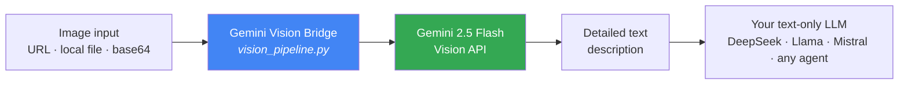

# Gemini Vision Bridge

**Give vision to any text-only LLM or AI agent — no built-in vision model required.**

DeepSeek, Llama, Mistral, and most open-weight models **can't see images**. This tool bridges that gap by delegating image understanding to the Gemini 2.5 Flash API — free tier, fast, and with zero changes to your primary model.


---

## How It Works



- **No** dedicated vision model needed
- **No** GPU / VRAM required
- **No** need to switch your primary provider
- Just a **free Gemini API key**

---

## Features

| Feature | Status |
|---------|--------|
| Read images from URL | ✅ |
| Read images from local files | ✅ |
| Base64 data URLs | ✅ |
| Works in any language — just ask in yours | ✅ |
| CLI interface | ✅ |
| Importable as a Python module | ✅ |
| Usable as a tool for Hermes / other agents | ✅ |
| Free-text / markdown output | ✅ |
| Timeout handling | ✅ |
| Robust error handling | ✅ |
| Lightweight — pure Python stdlib, zero `pip install` | ✅ |

---

## Installation

### 1. Get a Gemini API Key

**Option A — API key (recommended):**
1. Open https://aistudio.google.com/apikey
2. Click "Create API Key"
3. Copy the key (format: `AIzaSy...` or UUID `xxxx-xxxx`)

**Option B — OAuth token:**
An OAuth token from Google AI Studio (format `AQ.`) also works, but requires the OpenAI-compatible endpoint (see Troubleshooting).

### 2. Download the Script

```bash
curl -O https://raw.githubusercontent.com/nugrohosetiaji91-png/gemini-vision-bridge/main/vision_pipeline.py
```

Or clone the repo:
```bash
git clone https://github.com/nugrohosetiaji91-png/gemini-vision-bridge.git
cd gemini-vision-bridge
```

### 3. Set the API Key

**Via environment variable:**
```bash
export GEMINI_API_KEY="AIzaSy..."   # Linux/macOS
set GEMINI_API_KEY=AIzaSy...        # Windows CMD
$env:GEMINI_API_KEY="AIzaSy..."     # Windows PowerShell
```

**Via `.env` file** (same directory):
```
GEMINI_API_KEY="AIzaSy..."
```

---

## Usage

### CLI

```bash
# From a URL
python vision_pipeline.py "https://example.com/image.jpg" "What's in this image?"

# From a local file
python vision_pipeline.py "C:/Users/name/Downloads/photo.png" "Describe this in detail"

# Default question ("Describe this image in detail.")
python vision_pipeline.py "image.jpg"
```

### Python Module

```python
from vision_pipeline import analyze_image

# From a URL
result = analyze_image(
    "https://example.com/chart.png",
    "What does this chart show? List all the numbers."
)
print(result)

# From a local file
result = analyze_image(
    "C:/Users/name/Downloads/screenshot.png",
    "Find bugs in this UI."
)
```

### Hermes Agent Integration

```bash
# Call directly from a skill/task
python /path/to/vision_pipeline.py "screenshot.png" "Find layout issues"
```

Or set it as an **auxiliary vision provider**:

```bash
hermes config set auxiliary.vision.provider google
hermes config set auxiliary.vision.model gemini-2.5-flash
hermes config set auxiliary.vision.base_url "https://generativelanguage.googleapis.com/v1beta/openai"
```

> ⚠️ Run `/reset` on the session after changing auxiliary config.

---

## Use Cases

### 1. OCR — Extract Text from Images
```bash
python vision_pipeline.py "scanned_doc.jpg" "Extract all text in markdown format"
```
Great for: scanned documents, chat screenshots, handwritten notes.

### 2. UI Analysis / Screenshot Debugging
```bash
python vision_pipeline.py "bug_screenshot.png" "Find tofu characters, broken layout, or missing glyphs"
```
Great for: frontend debugging, pre-release UI review.

### 3. Reading Diagrams / Charts / Infographics
```bash
python vision_pipeline.py "sales_chart.png" "List every number and trend visible"
```
Great for: data analysis, presentations, reports.

### 4. Object Detection
```bash
python vision_pipeline.py "product_photo.jpg" "What objects are in this image?"
```
Great for: product catalogs, documentation.

### 5. Labeled Diagram Analysis
```bash
python vision_pipeline.py "horse_anatomy.jpg" "List every labeled part"
```

### 6. Giving Vision to an AI Agent
```python
# Example: an agent running DeepSeek/Llama with no vision capability
from vision_pipeline import analyze_image

def agent_see_image(path):
    """Helper for agents that have no vision."""
    description = analyze_image(path, "Describe in detail")
    return f"[VISUAL CONTEXT]\n{description}"

# The agent consumes this description as text input
agent_input = agent_see_image("chart.png")
```

---

## Troubleshooting

### "ERROR: No Gemini API key"
**Cause:** the key isn't set or isn't being read.
**Fix:**
```bash
# Check whether the key is set
echo $GEMINI_API_KEY   # Linux/macOS
echo %GEMINI_API_KEY%  # Windows

# Set it directly
export GEMINI_API_KEY="AIzaSy..."
```

### "HTTP 400 — This model only supports text output"
**Cause:** you're pointing at a Gemini model that doesn't support this request type.
**Fix:** make sure you're using `gemini-2.5-flash` (not `gemini-2.5-flash-image`).

### "HTTP 429 — Quota exceeded"
**Cause:** the free-tier daily quota is exhausted.
**Fix:**
- Wait for the quota reset (usually daily)
- Upgrade to a paid tier at https://ai.dev/projects
- Use a different Google AI Studio project

### "HTTP 404 — model not found for API version"
**Cause:** an OAuth token (`AQ.`) was sent as an API key instead of a bearer token.
**Fix:** set `base_url` to the OpenAI-compatible endpoint:
```bash
export GEMINI_BASE_URL="https://generativelanguage.googleapis.com/v1beta/openai"
```
Or use a regular API key (format `AIzaSy...`) instead of an OAuth token.

### Image URL fails to load
**Cause:** the server rejects the request or the URL is broken.
**Fix:** download the image first, then use the local file path.

### "HTTP Error 11001 — getaddrinfo failed"
**Cause:** the environment/sandbox has no network access.
**Fix:** run from an environment with internet access (VPS, local machine — not a restricted sandbox).

---

## Project Structure

```
gemini-vision-bridge/
├── vision_pipeline.py    # Main script (single file, zero dependencies)
├── README.md             # This documentation
├── .env.example          # Environment variable template
├── .gitignore
└── LICENSE               # MIT
```

---

## Why Use This?

| Problem | Solution |
|---------|----------|
| Your model is text-only (DeepSeek, Llama, Mistral, ...) | Borrow Gemini's eyes |
| Don't want to pay for an expensive vision model | Gemini 2.5 Flash has a **free tier** |
| Complex vision pipelines are a pain to set up | **One Python file, zero dependencies** |
| Need multilingual output | Gemini supports it — just ask in your language |

---

## License

MIT — free to use, modify, and distribute.

---

## Credits

- [Google Gemini API](https://ai.google.dev) — vision backend
- [Hermes Agent](https://hermes-agent.nousresearch.com) — agent framework
- Inspired by [Ollama-OCR](https://github.com/imanoop7/Ollama-OCR) by imanoop7

---

**Built by [@hybridsapiens](https://github.com/nugrohosetiaji91-png)**
